# Pipeline Architecture Diagram

## Workflow Execution Flow

### Container Security Scan
1. **Trigger**: Push to main/develop or Pull Request
2. **Build**: Docker image is built from Dockerfile
3. **Scan**: Trivy scans the built image in three formats:
   - SARIF (for GitHub Security integration)
   - Table (for human-readable logs)
   - JSON (for programmatic analysis)
4. **Report**: Results uploaded to GitHub Security and available as artifacts

### Dockerfile Security Scan
1. **Trigger**: Push to main/develop or Pull Request
2. **Scan**: Trivy analyzes Dockerfile for:
   - Security misconfigurations
   - Best practice violations
   - Potential vulnerabilities
3. **Report**: Results uploaded to GitHub Security

## Security Scanning Stages

## Vulnerability Severity Flow

```mermaid
flowchart TD
    A[Vulnerability Detected] --> B{Severity Level}
    
    B -->|CRITICAL| C[🔴 Immediate Action]
    B -->|HIGH| D[🟠 Fix ASAP]
    B -->|MEDIUM| E[🟡 Schedule Fix]
    B -->|LOW| F[🟢 Track for Later]
    
    C --> G[Block Deployment]
    D --> H[Create Issue]
    E --> H
    F --> H
    
    H --> I[Assign to Team]
    I --> J[Implement Fix]
    J --> K[Re-scan]
    K --> L{Fixed?}
    L -->|Yes| M[Close Alert]
    L -->|No| J
    
    style A fill:#fff3e0
    style C fill:#ffcdd2
    style D fill:#ffccbc
    style E fill:#fff9c4
    style F fill:#c8e6c9
    style M fill:#a5d6a7
```

